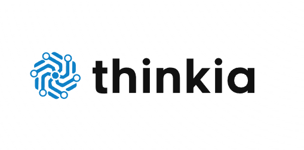

ChatGPT Plus
md
Copiar
Editar
# Thinkia



## Descripción

Thinkia es un chat interactivo construido con Angular (v19) que utiliza la inteligencia artificial de **Gemini** para configurar asistentes personalizados. Permite a los usuarios establecer objetivos, preferencias y restricciones, y recibir respuestas inteligentes basadas en aprendizaje profundo.

---

## Características

- 📱 **Single Page Application** desarrollada con Angular 19.  
- 🤖 **Integración con Gemini AI** mediante un servicio dedicado.  
- 💬 **Interfaz de chat** con burbujas de conversación diferenciadas (usuario vs IA).  
- 🔄 **Scroll automático** al último mensaje.  
- ⏳ **Spinner de carga** mientras la IA procesa la petición.  
- 🌙 **Soporte Dark/Light Mode** configurable en tiempo real.  
- 🎨 **Diseño responsive** basado en CSS variables y PrimeNG.  
- 🧩 **Componentes standalone** para header, footer y chat.

---

## Requisitos previos

- Node.js >= 18.x  
- npm >= 9.x  
- Angular CLI >= 19.2.15

---

## Instalación

1. Clona el repositorio:  
   ```bash
   git clone https://github.com/tu-usuario/thinkia.git
   cd thinkia
Instala las dependencias:

bash
Copiar
Editar
npm install
Crea un archivo .env en la raíz con tus credenciales de Gemini:

ini
Copiar
Editar
GEMINI_API_KEY=tu_api_key_aquí
GEMINI_ENDPOINT=https://api.gemini.com/v1/chat
Construye y sirve la aplicación en modo desarrollo:

bash
Copiar
Editar
ng serve
Abre tu navegador en http://localhost:4200.

Configuración de GeminiService
El servicio GeminiService se encarga de enviar solicitudes a la API de Gemini y procesar las respuestas.

ts
Copiar
Editar
// src/app/services/gemini.service.ts
import { Injectable } from '@angular/core';
import { HttpClient, HttpHeaders } from '@angular/common/http';
import { Observable } from 'rxjs';

interface GeminiResponse {
  candidates: { content: { parts: { text: string }[] }[] }[];
}

@Injectable({ providedIn: 'root' })
export class GeminiService {
  private apiKey = process.env.GEMINI_API_KEY;
  private endpoint = process.env.GEMINI_ENDPOINT;

  constructor(private http: HttpClient) {}

  public generate(prompt: string): Observable<GeminiResponse> {
    const headers = new HttpHeaders({
      Authorization: `Bearer ${this.apiKey}`
    });

    return this.http.post<GeminiResponse>(
      this.endpoint,
      { prompt },
      { headers }
    );
  }
}
Asegúrate de que tu proxy o CORS permita las solicitudes al endpoint de Gemini.

Estructura de carpetas
text
Copiar
Editar
thinkia/
├── src/
│   ├── app/
│   │   ├── features/
│   │   │   └── chat/
│   │   │       ├── chat.component.ts
│   │   │       ├── chat.component.html
│   │   │       └── chat.component.css
│   │   ├── shared/
│   │   │   ├── header/
│   │   │   └── footer/
│   │   └── services/
│   │       └── gemini.service.ts
│   ├── assets/
│   │   └── logo.png
│   ├── environments/
│   └── index.html
├── README.md
└── package.json
Scripts disponibles
bash
Copiar
Editar
# Servir en modo desarrollo (live reload)
ng serve

# Compilar para producción
ng build --prod

# Ejecutar tests unitarios
ng test

# Ejecutar pruebas E2E
ng e2e
Contribuir
Haz un fork del proyecto.

Crea una branch (git checkout -b feature/nueva-funcion).

Haz tus cambios y commitea (git commit -m 'Agrega nueva función').

Sube tu branch (git push origin feature/nueva-funcion).

Abre un Pull Request.

Licencia
Este proyecto está bajo la licencia MIT. Revisa el archivo LICENSE para más detalles.

© 2025 Thinkia

Copiar
Editar
